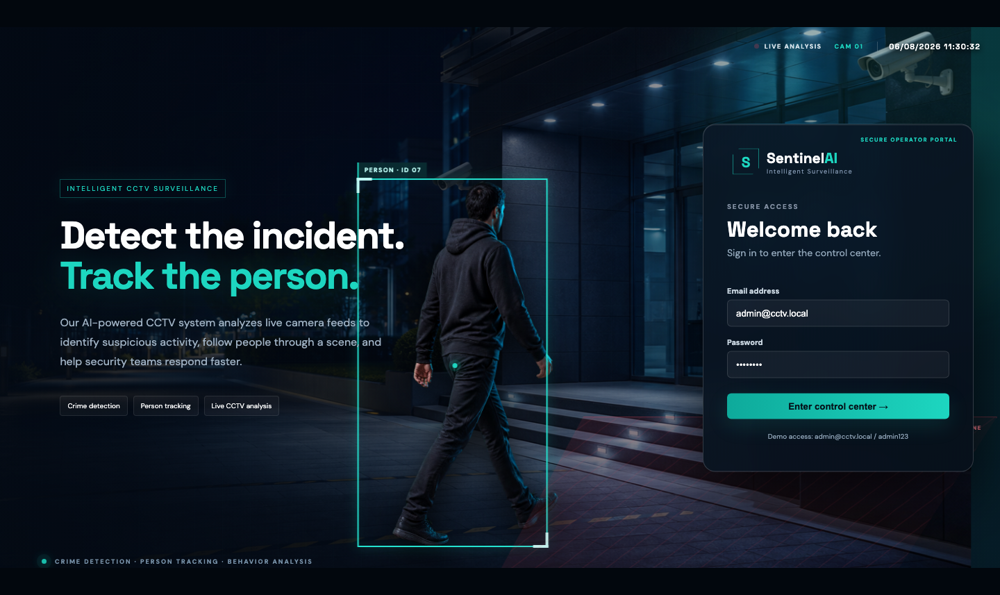
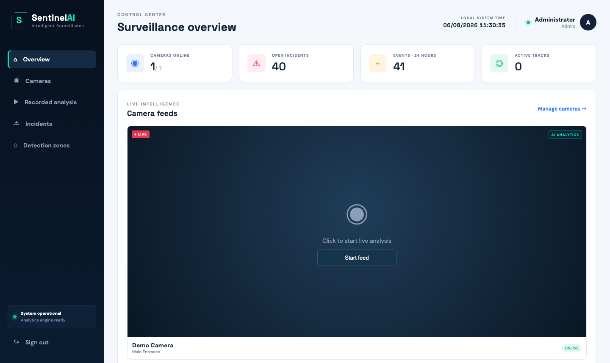
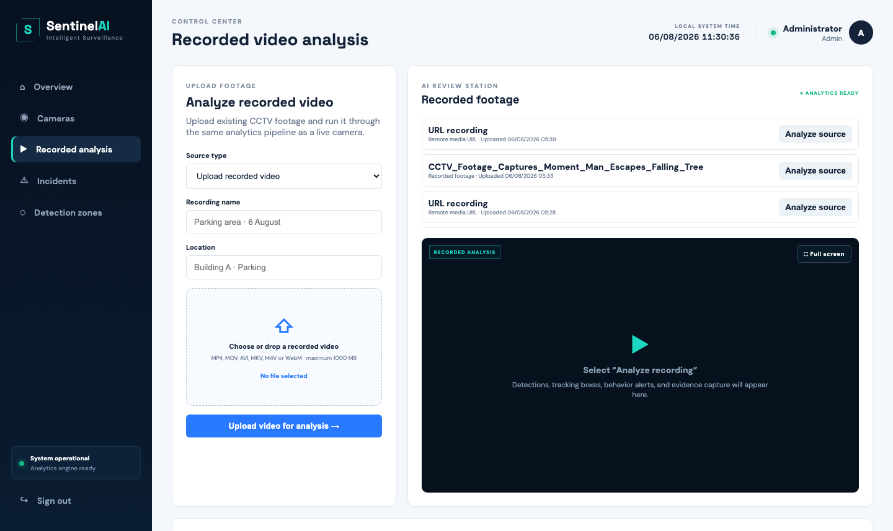
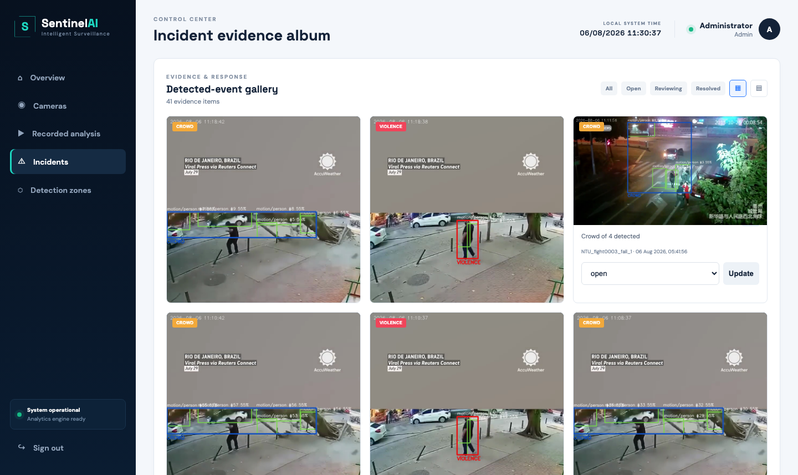
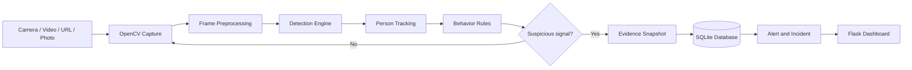

<div align="center">



# Sentinel AI

### Intelligent CCTV Surveillance for Crime Detection, Behavioral Analysis and Person Tracking

[](https://www.python.org/)
[](https://flask.palletsprojects.com/)
[](https://opencv.org/)
[](https://docs.ultralytics.com/)
[](LICENSE)

**Live CCTV · Recorded Video · Direct Streams · Photo Analysis · Evidence Management**

[Features](#main-capabilities) · [Architecture](#system-architecture) · [Installation](#installation) · [Usage](#using-the-system) · [Safety](#privacy-safety-and-responsible-operation)

</div>

---

Sentinel AI is a Python and Flask surveillance application that transforms live CCTV streams, recorded videos, direct media URLs, and uploaded photographs into a monitored incident workflow. The system captures frames with OpenCV, detects people and objects, maintains track identities, evaluates behavioral rules, stores visual evidence, generates alerts, and presents the results in a web-based security control center.

This project follows the supplied mind map:

```text
Camera / Recording / Photo
            ↓
Frame capture and preprocessing
            ↓
Person and object detection
            ↓
Person tracking
            ↓
Behavior and event analysis
            ↓
Alert generation and evidence storage
            ↓
Dashboard, incident review and reports
```

> Behavioral detections are screening signals for a trained human operator. They must not be treated as proof of guilt, intent, identity, or criminal activity.

## Application preview

### Cinematic secure login

The login page presents the system as a full-screen CCTV monitoring experience. It includes a moving person, synchronized tracking box, restricted-zone visualization, project advertisements, live date, and a 24-hour clock.


### Surveillance control center

The control center summarizes online cameras, unresolved incidents, recent events, and active tracks. The main camera occupies a large monitoring screen and uses the same analytics pipeline as uploaded recordings.



### Recorded-video analysis

Security staff can upload a recording of up to 1000 MB, supply a direct video/stream URL, or upload a photograph. Recorded videos are synchronized to their original FPS and can be reviewed in fullscreen without cropping.



### Incident evidence album

Detected events are stored as an evidence gallery. Operators can filter incidents, switch gallery views, open a large preview, zoom, move between images, download evidence, and update review status.



## Main capabilities

### Input sources

- Default computer webcam (`0`)
- USB and connected cameras supported by OpenCV
- RTSP and RTMP camera streams
- Direct HTTP/HTTPS video streams and media files
- Uploaded MP4, MOV, AVI, MKV, M4V and WebM recordings
- Uploaded JPG, JPEG, PNG, WebP and BMP photographs
- Maximum HTTP upload size of 1000 MB

YouTube pages and YouTube Shorts URLs are not direct media streams and cannot be decoded by OpenCV. Download the recording lawfully and upload the resulting video file instead.

### Detection and tracking

- Person and object detection through an optional YOLO backend
- Lightweight motion-region detection when YOLO is disabled
- Persistent YOLO track IDs when the model supports tracking
- Centroid-based tracking fallback
- Bounding boxes, labels, confidence values and track identifiers
- Restricted polygon zones configured per camera

### Behavioral and event analysis

| Detector | Purpose | Current method |
|---|---|---|
| Intrusion | Detect entry into a configured restricted polygon | Track center inside zone |
| Loitering | Identify prolonged presence in a small area | Dwell time and movement radius |
| Crowd | Identify a configurable number of people in one frame | Person count threshold |
| Rapid interaction | Flag fast, overlapping person movement for review | Motion-speed and overlap heuristic |
| Abandoned object | Flag a detected object that remains stationary | Object position and dwell time |
| Weapon | Flag configured weapon classes | Model classification output |

The rapid-interaction detector is intentionally described as a review signal rather than a definitive “violence” judgment. Reliable weapon and action recognition requires domain-specific weights trained and evaluated for the installation environment.

### Evidence and response

- Timestamped evidence snapshots
- Incident type, confidence, camera, location and description
- Dashboard alert records
- Evidence album with large preview and keyboard navigation
- Zoom and evidence download
- Open, reviewing, resolved and false-positive states
- Date and 24-hour clock on authenticated pages

## System architecture



The detection module is deliberately separated from the Flask application. This makes it possible to replace YOLOv8 with another detector, replace centroid tracking with ByteTrack or DeepSORT, or introduce a trained action-recognition model without rewriting the dashboard and database layers.

## Project structure

```text
.
├── app.py                       Flask routes, authentication and streaming
├── config.py                    Environment and storage configuration
├── detection.py                 Detection, tracking and behavior rules
├── models.py                    SQLAlchemy database models
├── requirements.txt             Runtime dependencies
├── templates/
│   ├── base.html                Shared authenticated layout
│   ├── login.html               Cinematic login and advertisement
│   ├── dashboard.html           Live surveillance overview
│   ├── cameras.html             Camera configuration
│   ├── recordings.html          Video, URL and photo analysis
│   ├── incidents.html           Evidence album and review workflow
│   └── zones.html               Restricted-zone configuration
├── static/
│   ├── app.js                   Browser interaction and live clocks
│   ├── style.css                Main visual design
│   ├── responsive.css           Device-specific responsive layout
│   └── images/                  Login advertisement assets
├── instance/
│   ├── evidence/                Generated incident snapshots
│   ├── uploads/                 Uploaded media
│   └── surveillance.db          SQLite database, generated at runtime
└── docs/screenshots/            README feature screenshots
```

## Database design

The SQLite database is managed through Flask-SQLAlchemy.

| Model | Stored information |
|---|---|
| `User` | Name, email, hashed password, role and creation time |
| `Camera` | Camera name, location, device/path/URL and status |
| `Zone` | Camera relationship, polygon points, schedule and active state |
| `TrackedPerson` | Track key, camera, entry, exit, last seen and image |
| `Incident` | Event type, camera, track, confidence, time, evidence and status |
| `Alert` | Incident relationship, message, recipient, delivery and read state |

The first application start automatically creates the schema, a demonstration administrator and a default webcam source.

## Installation

### Requirements

- Python 3.9 or newer
- A modern browser
- A webcam, video recording, direct media URL or photograph
- Optional GPU for higher-throughput inference

### Create the environment

```bash
python3 -m venv .venv
source .venv/bin/activate
pip install -r requirements.txt
```

### Configure the application

Copy the example environment file if custom settings are required:

```bash
cp .env.example .env
```

Available settings:

| Variable | Default | Description |
|---|---|---|
| `SECRET_KEY` | Development value | Flask session signing secret |
| `DATABASE_URL` | Local SQLite file | SQLAlchemy database connection |
| `EVIDENCE_DIR` | `instance/evidence` | Generated evidence directory |
| `UPLOAD_DIR` | `instance/uploads` | Uploaded media directory |
| `ENABLE_YOLO` | `false` | Enables the Ultralytics backend |
| `YOLO_MODEL` | `yolov8n.pt` | Model path or model name |
| `PORT` | `5000` | Flask listening port |

Change the session secret and default administrator credentials before a real deployment.

## Running the application

Port 5000 is commonly occupied by AirPlay Receiver on macOS. Use port 5001:

```bash
source .venv/bin/activate
PORT=5001 python3 app.py
```

Open one of the following addresses:

```text
http://127.0.0.1:5001
http://<computer-LAN-address>:5001
```

Demonstration login:

```text
Email:    admin@cctv.local
Password: admin123
```

## Enabling YOLO

The default fallback is useful for demonstrating frame capture, motion regions, tracking, evidence storage and the incident workflow. It does not provide reliable still-photo classification or real weapon classes.

Install Ultralytics and enable the model:

```bash
source .venv/bin/activate
pip install ultralytics
export ENABLE_YOLO=true
export YOLO_MODEL=yolov8n.pt
PORT=5001 python3 app.py
```

The first model use may download weights. A standard COCO model recognizes common objects and people, but it is not a complete crime-detection model. Use properly licensed, domain-specific weights for weapons and action recognition.

## Using the system

### Add a live camera

1. Sign in and open **Cameras**.
2. Enter a name and physical location.
3. Use `0` for the default webcam or provide an RTSP/direct stream URL.
4. Return to **Overview** and select **Start feed**.

### Configure an intrusion zone

1. Open **Detection zones**.
2. Select the camera.
3. Enter a zone name.
4. Enter at least three pixel coordinates separated by semicolons.

Example:

```text
100,100;500,100;500,400;100,400
```

Coordinates refer to the processed frame, whose width is limited to 960 pixels for performance.

### Analyze recorded footage

1. Open **Recorded analysis**.
2. Select **Upload recorded video**, **Video or stream URL**, or **Upload photo**.
3. Enter a useful recording name and location.
4. Upload the source or provide the direct media URL.
5. Select **Analyze source**.
6. The viewer opens fullscreen and preserves the complete frame.
7. Press `Esc` to exit fullscreen.

Uploaded videos are paced using their encoded FPS, so a 24 FPS recording is reviewed at 24 FPS instead of running at CPU speed.

### Review incidents

1. Open **Incidents**.
2. Filter the album by workflow status.
3. Select an evidence image to open the lightbox.
4. Use the arrow buttons or keyboard arrow keys to navigate.
5. Zoom or download evidence when required.
6. Set the incident to reviewing, resolved or false positive.

## HTTP routes

| Route | Purpose |
|---|---|
| `/login` | Secure operator login |
| `/` | Surveillance dashboard |
| `/cameras` | Camera configuration |
| `/recordings` | Recorded video, URL and photo inputs |
| `/video/<camera_id>` | Annotated MJPEG analytics stream |
| `/zones` | Restricted-zone management |
| `/incidents` | Incident evidence album |
| `/api/incidents` | Incident polling API |
| `/health` | Application health response |

## Detection tuning

Defaults are defined in `AnalyticsEngine.analyse()` and can be supplied through a settings dictionary:

| Setting | Default | Meaning |
|---|---:|---|
| `loiter_seconds` | 20 | Minimum stationary duration |
| `loiter_radius` | 80 px | Maximum movement within the dwell period |
| `crowd_count` | 4 | People required for a crowd event |
| `violence_motion` | 90 | Rapid-interaction motion threshold |
| `abandoned_seconds` | 45 | Static-object dwell duration |
| `static_radius` | 35 px | Allowed stationary-object movement |

Thresholds must be calibrated using footage from the actual camera angle, frame rate, lighting and environment.

## Privacy, safety and responsible operation

- Keep a trained person in the decision loop.
- Do not label a person as a criminal based only on an automated signal.
- Measure and document false-positive and false-negative rates.
- Test performance across lighting, clothing, mobility and demographic conditions.
- Restrict access to recordings, evidence and user accounts.
- Encrypt data in transit and at rest for production use.
- Define retention periods and remove expired evidence.
- Display legally required CCTV notices.
- Obtain a lawful basis before adding biometric or face-identification features.
- Maintain an audit trail for incident status and evidence access.

## Production recommendations

The included Flask server is a development server. A production deployment should add:

- Gunicorn, Waitress or another production WSGI server
- PostgreSQL or another managed database
- HTTPS through a reverse proxy
- CSRF protection and stronger role authorization
- Changed administrator credentials and secrets
- Rate limiting and account lockout
- Background workers for long video analysis
- WebSocket or server-sent-event alerts
- Evidence encryption and retention jobs
- Monitoring, structured logs and audit history
- Domain-specific model validation and version control

## Troubleshooting

### Port already in use

```bash
PORT=5001 python3 app.py
```

### Updated page is not visible

Stop the old Flask process, restart the application, and hard-refresh the browser:

```bash
pkill -f "python3 app.py"
PORT=5001 python3 app.py
```

On macOS use `Command + Shift + R` for a hard refresh.

### Direct URL does not play

Confirm that the URL points directly to a decodable video file or stream. YouTube page URLs, login-protected pages and ordinary HTML pages cannot be passed directly to OpenCV.

### Photo has no detections

Enable YOLO. Motion fallback requires a sequence of changing frames and is not designed to classify a single still image.

### Video processing is slow

- Use the smaller `yolov8n.pt` model.
- Reduce source resolution.
- Use a GPU-supported PyTorch installation.
- Analyze fewer streams simultaneously.

## Future improvements

- ByteTrack or DeepSORT integration across cameras
- Trained action-recognition model for temporal behaviors
- Domain-specific weapon detector
- Asynchronous recorded-video job queue with progress reporting
- Configurable rules and thresholds through the dashboard
- Email, SMS and push notification providers
- User management and granular permissions
- Searchable incident reports and analytics charts
- Evidence retention and audit policies

## License and model data

Review the licenses of every AI model, training dataset and third-party dependency before deployment. Surveillance laws and notification requirements differ by location; the system operator is responsible for lawful use.
